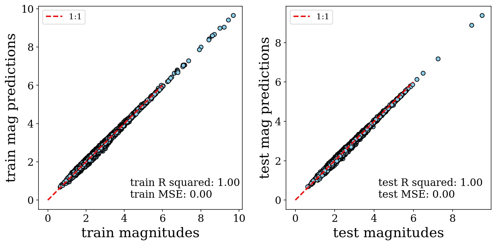

About
=====
This library is a collection of test projects to explore different machine learning methods for predicting moment magnitude (Mw) for earthquakes in Utah. 
The proposed models will be under the category of supervised learning (for now). The moment magnitude data are computed via a combination of the methods of [Holt (2019)](https://livrepository.liverpool.ac.uk/3064483/1/200880943_Sep2019.pdf) and [Holt *et al.* (2021)](https://doi.org/10.1785/0220200320)

    <figure style="text-align:center">
        
        <figcaption>Fig. 1 - Comparing predicted Mw (from linear regression) with the actual Mw for events in the test 'holdout' Mw dataset.</figcaption>
    </figure>

Table of Contents (Jupyter Notebooks)
=================
1. [Data Preparation](jupyter-notebooks/2021_07_25_jh_1_data_prep.ipynb)
2. [Linear Regression](jupyter-notebooks/2021_07_25_jh_2_linear_models.ipynb)